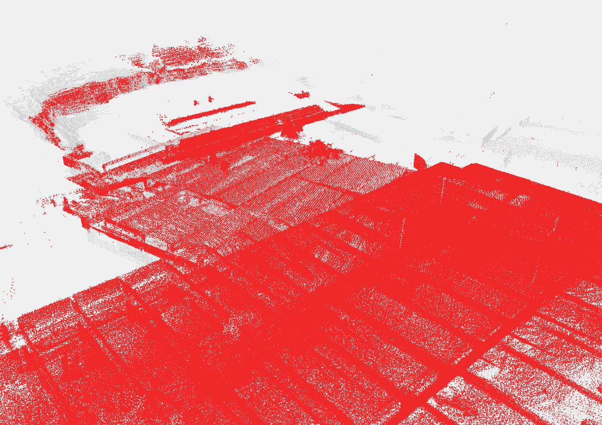
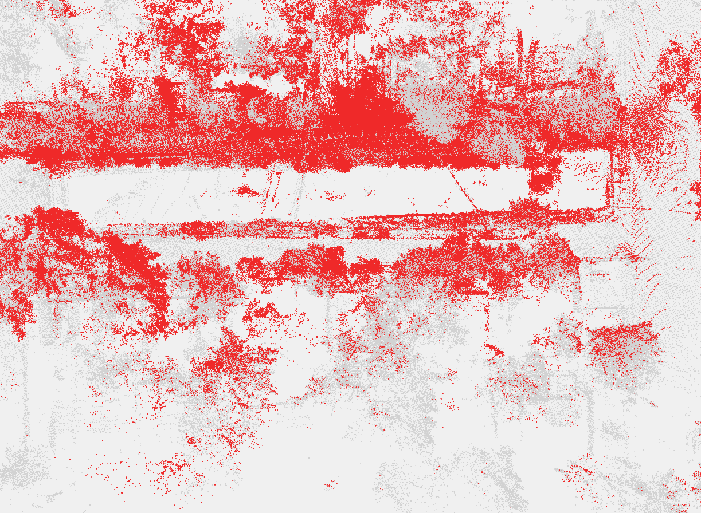
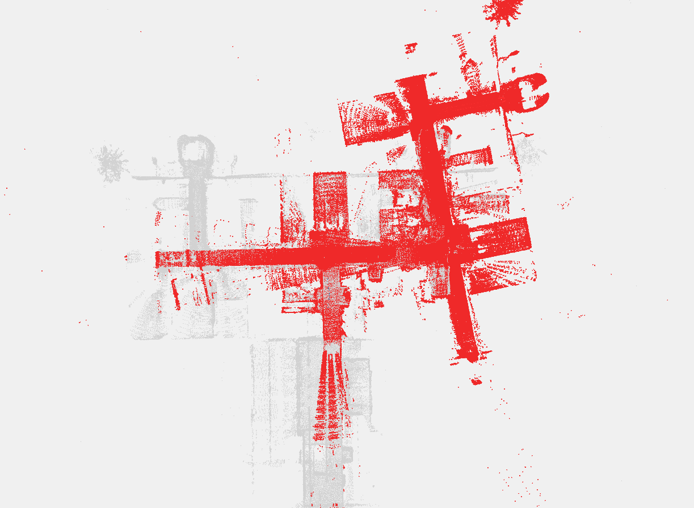
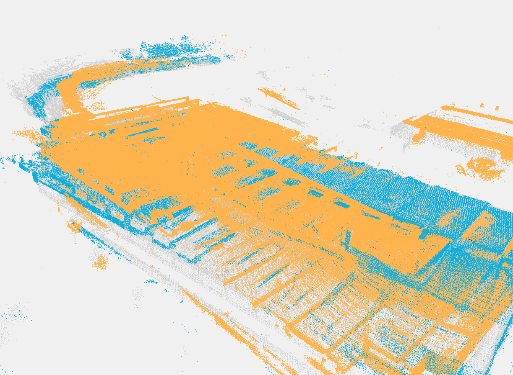
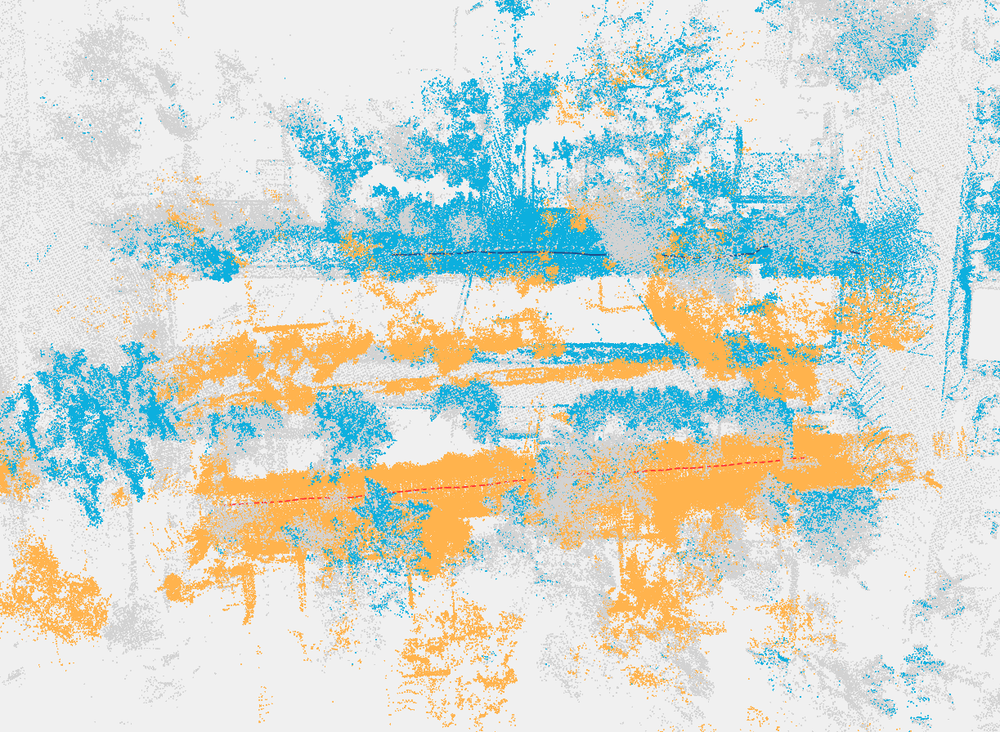
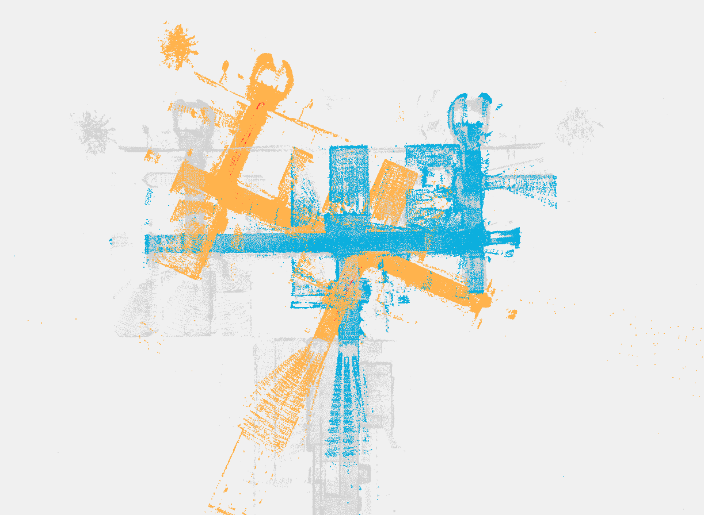
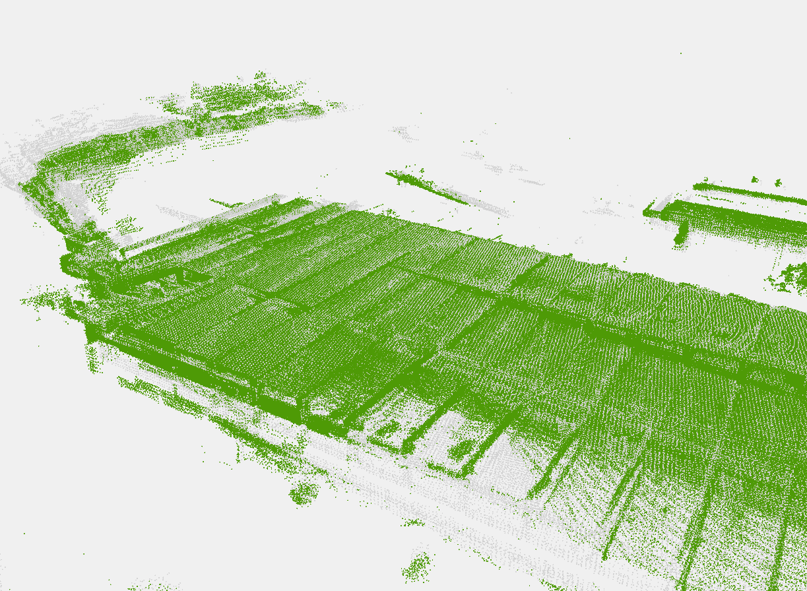
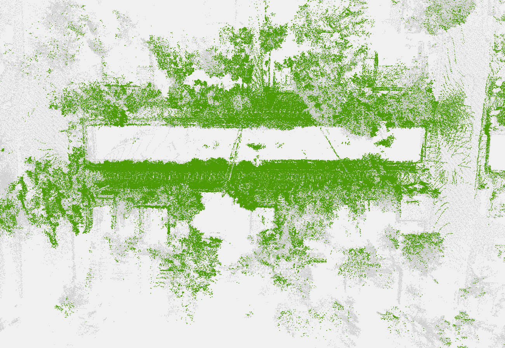
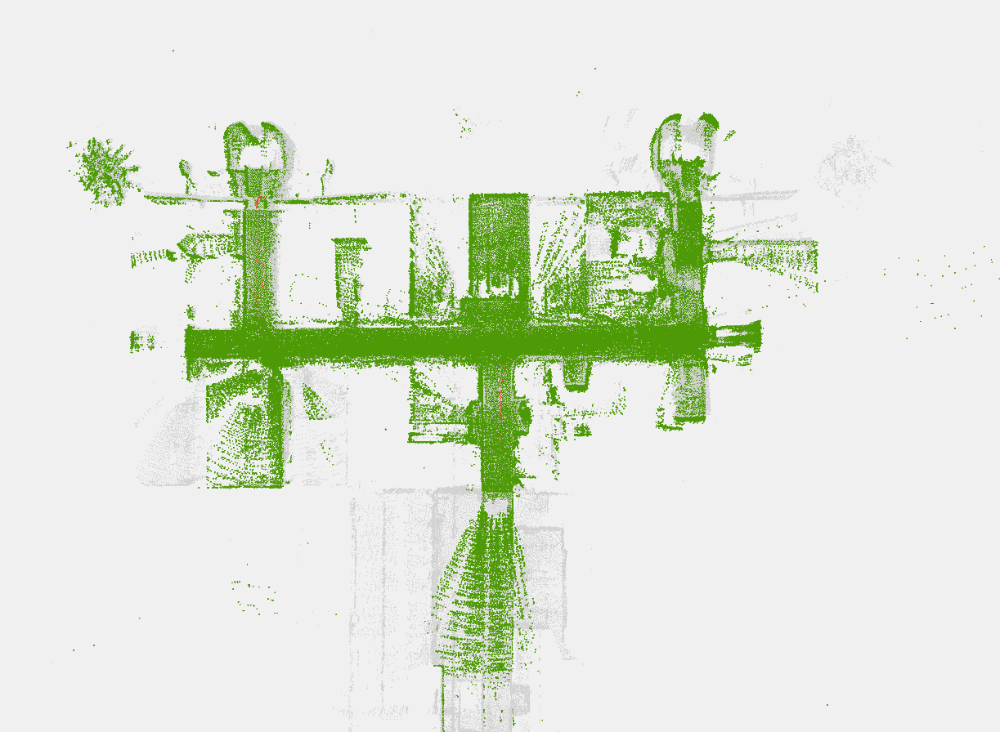
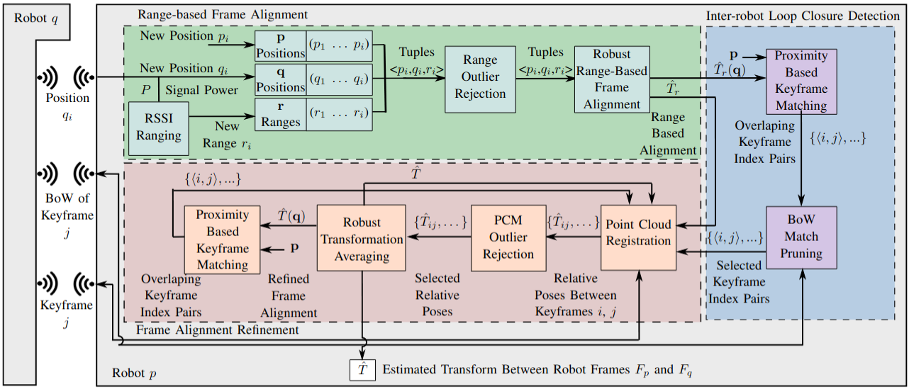

# WiLD-Align

**WiFi Localization Driven Frame Alignment (WiLD-Align) is a frame alignment pipeline that incorporates Wi-Fi RSSI-based range measurements into inter-robot frame alignment. By narrowing the loop closure search space and prioritizing keyframes for refinement, WiLD-Align reduces perceptual aliasing, communication requirements, and extraneous point cloud registrations.**

<p align="center">
    
</p>

<p align="center">
    <table>
        <tr>
            <td></td>
            <td></td>
            <td></td>
        </tr>
        <tr>
            <td></td>
            <td></td>
            <td></td>
        </tr>
        <tr>
            <td></td>
            <td></td>
            <td></td>
        </tr>
    </table>
</p>

*Top row:* Perceptual aliasing without WiLD-Align  
*Middle row:* Range alignments  
*Bottom row:* WiLD-Align results  
(Columns: Garage, Neighborhood, Building)

---

## Menu

- [**System Architecture**](#system-architecture)
- [**Package Dependencies**](#package-dependencies)
- [**Installation & Launch**](#installation)
- [**Setup**](#setup)
- [**Datasets**](#datasets)
- [**TODO**](#todo)
- [**Acknowledgement**](#acknowledgement)

---

## System Architecture

WiLD-Align integrates range measurements from Wi-Fi RSSI into an inter-robot frame alignment process. Pairwise Consistency Maximization (PCM) identifies consistent constraints, and selected keyframes are refined through point cloud registration.

<p align="center">
    
</p>

---

## Package Dependencies

- **[GTSAM](https://gtsam.org/)** — For PCM and keyframe handling  
- **[PMC]** — For Pairwise Maximum Clique  
- **[PCL](https://pointclouds.org/)** — For point cloud processing in WiLD-Align  
- **[ROS Noetic](http://wiki.ros.org/noetic)** — Core middleware

---

## Installation & Launch

### Install & Launch WiLD-Align
```bash
cd ~/wild_align_ws
git clone https://github.com/AnonymousUser964/WiLD_Align.git
cd WiLD_Align/scripts
bash build_all.sh
bash launch.sh
```

### Launch WiLD-Align Demo Mode
```bash
cd ~/wild_align_ws
git checkout demo
cd WiLD_Align/scripts
bash build_all_test.sh
bash launch_test.sh
```

## Setup for WiLD-Align

### General
There are configurations you will want to set for your specific system before running WiLD-Align, found in **`src/wild_align/src/WiLD_Align/config/params.yaml`**. These should be adjusted based on the quality of your incoming data, the maximum reliable distance to generate loop closures over, the accuracy of your ranging device (which is WiFi RSSI in our paper), and the minimum number of measurements you want to consider before attempting to integrate range-based alignments
-**registrationSearchDistance:** The max distance between range-aligned trajectories to be considered for loop closures; indoor/confined-->5-10m, outdoor/open-->15-25m
-**rangeNoiseBound:** The max range where distance measurements become dominated by noise; RSSI indoor/confined-->5-10m, RSSI outdoor/open-->15-30m
-**use2Dmapping:** Switch between 3D (good for multi-level environments) and 2D (faster and good for cartesian environements) GNC_LM range solvers
-**trustRSSIThreshold:** Sets a minimum range measurement requirement before solving (set to no less than 3)
-**residualErrorThresh:** Sets ICP fitness threshold for loop closure calculations (will depend on the quality of point clouds)
-**bowSearchWindow:** Sets pose neighborhood for the Bag of Words search of possible loop closures 

### Adding your own Lidar SLAM system 
> **Note:** This project includes a fork of LIO-SAM, whose parameters are adjusted to match the topics and data in the bags we provide. 
1. **Edit `src/wild_align/src/WiLD_Align/config/params.yaml`** to reflect your desired keyframe and ranging topics, and any expected thresholds.
2. **Add your SLAM system to src/slam/src** and remove LIO-SAM.
3. **Add the following ROS publisher and keyframe/trajectory publisher** to your SLAM system:
```cpp
#include <wildalign_msgs/keyframe.h>

ros::Publisher pubKeyframe;
pubKeyframe = nh.advertise<wildalign_msgs::keyframe>("wild_align/local_keyframe", 1);

static int trajectoryIter = 0;
static int numberMessagesSent = 0;
wildalign_msgs::keyframe thisKeyframe;
thisKeyframe.header = YourHeaderHere;

if (HasAnUpdateHappened) {
    std::vector<geometry_msgs::Pose> trajectory;
    /* Example for using iSAM2 estimate
    for (int i = 0; i < isamEstimate.size(); i++) {
        geometry_msgs::Pose pose;
        pose.position.x = isamEstimate.at<Pose3>(i).translation().x();
        pose.position.y = isamEstimate.at<Pose3>(i).translation().y();
        pose.position.z = isamEstimate.at<Pose3>(i).translation().z();
        pose.orientation.x = isamEstimate.at<Pose3>(i).rotation().roll();
        pose.orientation.y = isamEstimate.at<Pose3>(i).rotation().pitch();
        pose.orientation.z = isamEstimate.at<Pose3>(i).rotation().yaw();
        trajectory.push_back(pose);
    }
    */
    thisKeyframe.trajectoryIter = trajectoryIter++;
    thisKeyframe.poses = trajectory;
}

interPose.header = cloudInfo.header;
interPose.header.seq = numberMessagesSent;
interPose.pose.position.x = CurrentPose.x;
interPose.pose.position.y = CurrentPose.y;
interPose.pose.position.z = CurrentPose.z;
interPose.pose.orientation.x = CurrentPose.roll;
interPose.pose.orientation.y = CurrentPose.pitch;
interPose.pose.orientation.z = CurrentPose.yaw;
thisKeyframe.pose = interPose.pose;
thisKeyframe.cloud = CurrentKeyframeCloud;
thisKeyframe.seq = numberMessagesSent;
thisKeyframe.purpose = 2;
thisKeyframe.identifier = 0;
pubKeyframe.publish(thisKeyframe);
numberMessagesSent++;
```
4. **Add to `CMakeLists.txt`** under `find_package`, `generate_messages`, and `catkin_package`:
```
wildalign_msgs
```
5. **Add to `package.xml`**:
```xml
<build_depend>wildalign_msgs</build_depend> 
<run_depend>wildalign_msgs</run_depend> 
```
6. **Recompile** either through catkin_make or with scripts/build_all.sh

## Datasets
Robot pair datasets can be found on [Google Drive](https://drive.google.com/drive/folders/1nBQmlLJm1U56DQsAWjlI_VHNSGsOqWHh?usp=sharing) — containing LiDAR, IMU, and RSSI captures from two robots.These are designed to be run with the demo branch of this project. 

## TODO
- Update to ROS2 and provide CSLAM system integrations  
- Consolidate control variables into `params.yaml`  

## Acknowledgement
- WiLD-Align’s ROS framework was inspired by **[LIO-SAM](https://github.com/TixiaoShan/LIO-SAM)**  
- Uses **[Scan Context](https://github.com/irapkaist/scancontext)**  
- Uses **[Pairwise Consistency Maximization (PCM)](https://github.com/ethz-asl/pcm)**
```


